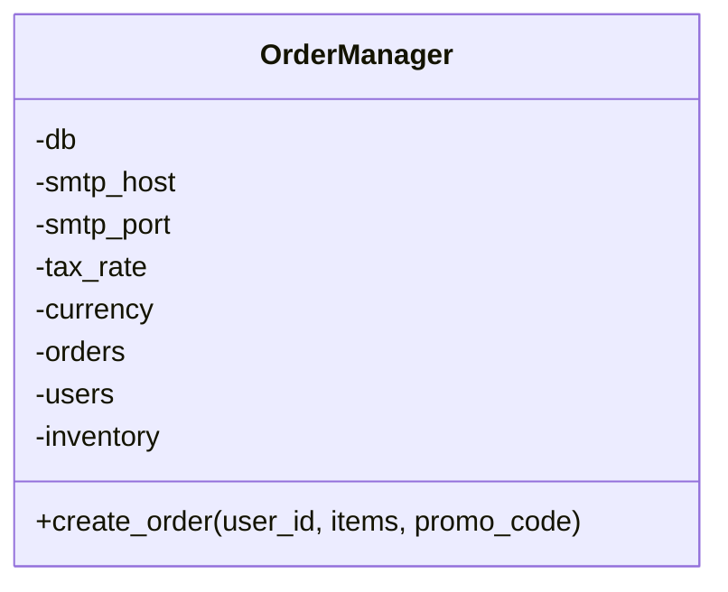
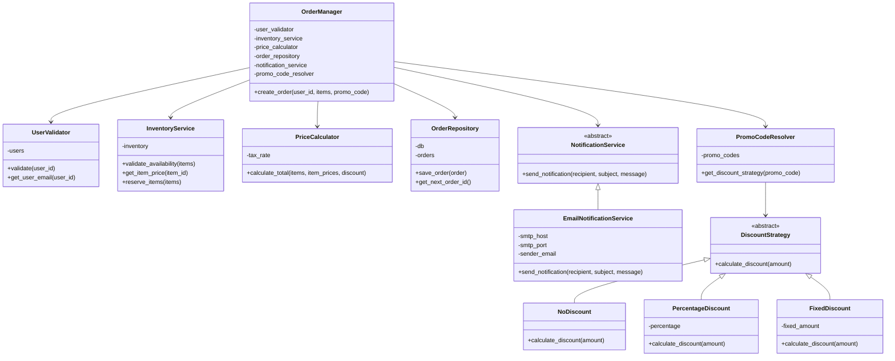

# Задание 1: God Object - OrderManager

## Анализ проблем

### Code Smells

#### 1. God Object / Large Class
Класс `OrderManager` отвечает за слишком много несвязанных функций:
- Валидация пользователей (строки 14-17)
- Управление инвентарем (строки 18-22, 30-31)
- Расчет цен и применение скидок (строки 23-28)
- Работа с базой данных (строка 35)
- Отправка email-уведомлений (строки 36-40)

#### 2. Long Method
Метод `create_order()` содержит 28 строк кода и выполняет множество разных операций.

#### 3. Shotgun Surgery
Для добавления нового типа скидки нужно изменять условия в методе (строки 27-28).

#### 4. Tight Coupling
- Прямое использование `smtplib` внутри метода
- Зависимость от конкретной реализации базы данных

#### 5. Security Issues
- SQL Injection (строка 35): `self.db.execute(f'INSERT INTO orders VALUES ({order})')`
- Hardcoded email (строка 39)

### Нарушения принципов SOLID

#### 1. SRP (Single Responsibility Principle) - НАРУШЕН
Класс имеет 5 различных ответственностей: валидация, инвентарь, расчет цен, БД, уведомления.

#### 2. OCP (Open/Closed Principle) - НАРУШЕН
Строки 27-28:
```python
if promo_code == 'SAVE10': total *= 0.9
elif promo_code == 'SAVE20': total *= 0.8
```
Для добавления нового промокода нужно изменять код метода.

#### 3. DIP (Dependency Inversion Principle) - НАРУШЕН
Класс зависит от конкретных реализаций (прямое создание `smtplib.SMTP`, прямой вызов `db.execute`), а не от абстракций.

### Метрики

#### Цикломатическая сложность метода `create_order()`

Подсчет условных переходов:
- Базовая сложность: 1
- `if user_id not in self.users`: +1
- `if self.users[user_id]['banned']`: +1
- `for item_id, qty in items.items()`: +1
- `if item_id not in self.inventory`: +1
- `if self.inventory[item_id]['stock'] < qty`: +1
- `for item_id, qty in items.items()`: +1
- `if promo_code == 'SAVE10'`: +1
- `elif promo_code == 'SAVE20'`: +1
- `for item_id, qty in items.items()`: +1

**Цикломатическая сложность ДО: 10** (норма <= 5)

## Решение

### Выделенные классы

1. **UserValidator** - валидация пользователей и получение их данных
2. **InventoryService** - управление запасами товаров
3. **PriceCalculator** - расчет итоговой стоимости с учетом налогов
4. **OrderRepository** - сохранение заказов в базу данных
5. **NotificationService** - отправка уведомлений (абстракция + EmailNotificationService)
6. **DiscountStrategy** - паттерн Strategy для скидок (NoDiscount, PercentageDiscount, FixedDiscount)
7. **PromoCodeResolver** - преобразование промокода в стратегию скидки

### Применение паттерна Strategy

Паттерн Strategy использован для скидок:
- Интерфейс `DiscountStrategy` с методом `calculate_discount()`
- Конкретные реализации: `NoDiscount`, `PercentageDiscount`, `FixedDiscount`
- `PromoCodeResolver` для преобразования промокода в стратегию

Теперь добавление нового типа скидки не требует изменения существующего кода (OCP).

### Как решены проблемы SOLID

- **SRP**: Каждый класс имеет одну ответственность
- **OCP**: Новые типы скидок добавляются через новые классы стратегий
- **DIP**: OrderManager зависит от абстракций (NotificationService, DiscountStrategy)

## UML-диаграммы

### Диаграмма классов ДО рефакторинга



### Диаграмма классов ПОСЛЕ рефакторинга



## Метрики

### Сравнение метрик ДО и ПОСЛЕ

| Метрика | ДО | ПОСЛЕ |
|---------|-----|-------|
| Цикломатическая сложность create_order() | 10 | 2 |
| Количество классов | 1 | 7 |
| Количество ответственностей | 5 | 1 (на класс) |
| Связанность (coupling) | Высокая | Низкая |
| Тестируемость | Низкая | Высокая |

### Цикломатическая сложность ПОСЛЕ


Метод `create_order()` в новой версии:
- Базовая сложность: 1
- Последовательные вызовы без ветвлений: +1

**Цикломатическая сложность ПОСЛЕ: 2** (отличный результат)

## Как запустить тесты

```bash
cd task1-god-object
pytest tests/
```
