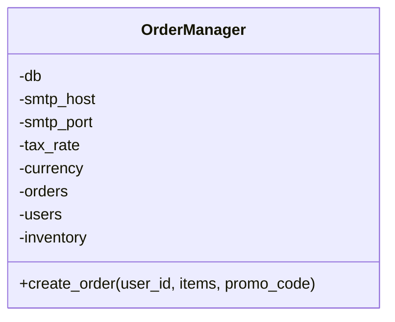

# Задание 1: God Object - OrderManager

## Проблемы

Класс OrderManager делает слишком много всего - в нем и проверка пользователей, и работа с товарами, и база данных, и отправка писем. Это классический God Object.

Основные косяки:
- Метод create_order() на 28 строк - делает вообще все подряд
- Чтобы добавить новую скидку, надо лезть в код и добавлять if-ы (строки 27-28)
- SQL инъекция в строке 35 - просто вставляем данные в запрос через f-строку
- Тестировать это невозможно - все завязано друг на друга

По SOLID нарушается главное:
- **SRP нарушен** - один класс делает 5 разных вещей
- **OCP нарушен** - для новой скидки надо менять код
- **DIP нарушен** - напрямую создаем SMTP и работаем с БД

Посчитал цикломатическую сложность create_order - вышло 10 (куча if-ов и циклов). Норма - до 5, так что это плохо.

## Что сделал

Разбил один большой класс на несколько маленьких:

1. **UserValidator** - проверяет пользователей
2. **InventoryService** - работает с товарами
3. **PriceCalculator** - считает цену с налогами
4. **OrderRepository** - сохраняет заказы в БД
5. **NotificationService** - отправляет уведомления
6. **DiscountStrategy** - паттерн для скидок

Для скидок сделал Strategy pattern - теперь каждая скидка это отдельный класс (PercentageDiscount, FixedDiscount, NoDiscount). Чтобы добавить новую скидку, просто создаю новый класс - не надо менять существующий код.

Теперь OrderManager просто координирует работу этих классов - он стал намного проще (цикломатическая сложность 2 вместо 10).

## UML-диаграммы

### Диаграмма классов ДО рефакторинга



### Диаграмма классов ПОСЛЕ рефакторинга


## Метрики

### Сравнение метрик ДО и ПОСЛЕ

| Метрика | ДО | ПОСЛЕ |
|---------|-----|-------|
| Цикломатическая сложность create_order() | 10 | 2 |
| Количество классов | 1 | 7 |
| Количество ответственностей | 5 | 1 (на класс) |
| Связанность (coupling) | Высокая | Низкая |
| Тестируемость | Низкая | Высокая |

### Цикломатическая сложность ПОСЛЕ


Метод `create_order()` в новой версии:
- Базовая сложность: 1
- Последовательные вызовы без ветвлений: +1

**Цикломатическая сложность ПОСЛЕ: 2** (отличный результат)

## Как запустить тесты

```bash
cd task1-god-object
pytest tests/
```
