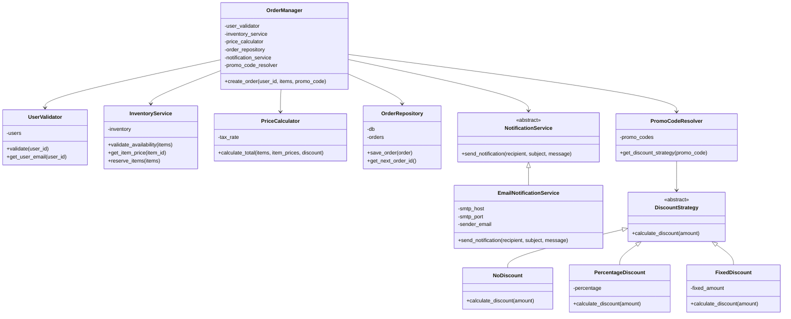

# UML-диаграмма классов ПОСЛЕ рефакторинга

```mermaid
classDiagram
    class OrderManager {
        -user_validator
        -inventory_service
        -price_calculator
        -order_repository
        -notification_service
        -promo_code_resolver
        +create_order(user_id, items, promo_code)
    }

    class UserValidator {
        -users
        +validate(user_id)
        +get_user_email(user_id)
    }

    class InventoryService {
        -inventory
        +validate_availability(items)
        +get_item_price(item_id)
        +reserve_items(items)
    }

    class PriceCalculator {
        -tax_rate
        +calculate_total(items, item_prices, discount)
    }

    class OrderRepository {
        -db
        -orders
        +save_order(order)
        +get_next_order_id()
    }

    class NotificationService {
        <<abstract>>
        +send_notification(recipient, subject, message)
    }

    class EmailNotificationService {
        -smtp_host
        -smtp_port
        -sender_email
        +send_notification(recipient, subject, message)
    }

    class DiscountStrategy {
        <<abstract>>
        +calculate_discount(amount)
    }

    class NoDiscount {
        +calculate_discount(amount)
    }

    class PercentageDiscount {
        -percentage
        +calculate_discount(amount)
    }

    class FixedDiscount {
        -fixed_amount
        +calculate_discount(amount)
    }

    class PromoCodeResolver {
        -promo_codes
        +get_discount_strategy(promo_code)
    }

    OrderManager --> UserValidator
    OrderManager --> InventoryService
    OrderManager --> PriceCalculator
    OrderManager --> OrderRepository
    OrderManager --> NotificationService
    OrderManager --> PromoCodeResolver

    NotificationService <|-- EmailNotificationService
    DiscountStrategy <|-- NoDiscount
    DiscountStrategy <|-- PercentageDiscount
    DiscountStrategy <|-- FixedDiscount
    PromoCodeResolver --> DiscountStrategy
```
