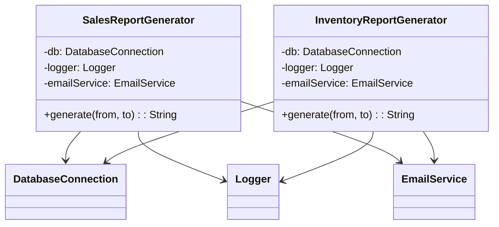
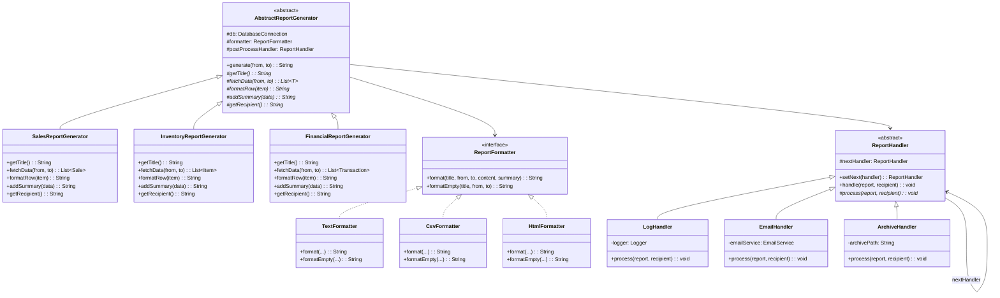

# Задание 2: Template Method - генераторы отчетов

## Анализ проблем

### Клоны кода (Code Clones)

#### Type II - Структурные клоны
Два класса `SalesReportGenerator` и `InventoryReportGenerator` имеют почти идентичную структуру с разными именами переменных и типами данных.

**Дублированные элементы:**

1. **Структура конструктора** (идентична в обоих классах):
```java
private DatabaseConnection db;
private Logger logger;
private EmailService emailService;

public Constructor(DatabaseConnection db, Logger logger, EmailService emailService) {
    this.db = db;
    this.logger = logger;
    this.emailService = emailService;
}
```

2. **Общий алгоритм метода generate():**
   - Создание StringBuilder
   - Добавление заголовка (строки 16-17 в SalesReportGenerator, строки 16-17 в InventoryReportGenerator)
   - Добавление периода (строка 18 в обоих)
   - Запрос данных из БД (строки 20-21 в обоих)
   - Проверка на пустоту (строки 23-26 в обоих)
   - Обработка данных в цикле
   - Логирование (строка 34 в SalesReportGenerator, строка 34 в InventoryReportGenerator)
   - Отправка email (строка 35 в обоих)
   - Возврат результата (строка 37 в обоих)

3. **Идентичная обработка пустых данных:**
```java
if (data.isEmpty()) {
    sb.append("No data\n");
    return sb.toString();
}
```

**Процент дублирования:** ~70% кода идентичен или очень похож.

### Проблемы проектирования

#### 1. Нарушение DRY (Don't Repeat Yourself)
Общий алгоритм генерации отчета дублируется в каждом классе.

#### 2. Shotgun Surgery
Для изменения процесса генерации отчета (например, добавление нового этапа обработки) нужно модифицировать каждый класс генератора.

#### 3. Жесткая привязка к формату
Формат вывода (текст с StringBuilder) захардкоден в методе. Нельзя легко изменить формат на CSV или HTML.

#### 4. Отсутствие гибкости в постобработке
Логирование и отправка email жестко встроены в метод generate(). Нельзя добавить архивирование или другие этапы без изменения кода.

### Метрики

#### WMC (Weighted Methods per Class) - ДО

**SalesReportGenerator:**
- Метод `generate()`: сложность 3 (1 if, 1 for, 1 базовая)
- WMC = 3

**InventoryReportGenerator:**
- Метод `generate()`: сложность 2 (1 if, 1 for)
- WMC = 2

**Общая WMC для системы: 5**

## Решение

### Применение паттернов

#### 1. Template Method
Абстрактный класс `AbstractReportGenerator<T>` определяет скелет алгоритма генерации отчета в методе `generate()` (final):
- Получить заголовок
- Загрузить данные
- Проверить на пустоту
- Форматировать каждую строку
- Добавить итоги
- Постобработка

Конкретные классы переопределяют только специфичные шаги:
- `SalesReportGenerator`
- `InventoryReportGenerator`
- `FinancialReportGenerator` (новый тип отчета)

#### 2. Strategy для форматирования
Интерфейс `ReportFormatter` с реализациями:
- `TextFormatter` - текстовый формат
- `CsvFormatter` - CSV формат
- `HtmlFormatter` - HTML формат

Теперь можно менять формат отчета без изменения генераторов.

#### 3. Chain of Responsibility для постобработки
Абстрактный класс `ReportHandler` с цепочкой обработчиков:
- `LogHandler` - логирование
- `EmailHandler` - отправка email
- `ArchiveHandler` - архивирование

Обработчики можно комбинировать в любом порядке.

### Как решены проблемы

- **DRY**: Общий алгоритм вынесен в AbstractReportGenerator
- **Shotgun Surgery**: Изменения в алгоритме делаются только в одном месте
- **OCP**: Новые типы отчетов, форматов и обработчиков добавляются через наследование
- **Гибкость**: Можно динамически менять форматы и постобработку

## UML-диаграммы

### Диаграмма классов ДО рефакторинга



### Диаграмма классов ПОСЛЕ рефакторинга



## Метрики

### Сравнение WMC (Weighted Methods per Class)

| Класс | ДО | ПОСЛЕ |
|-------|-----|-------|
| SalesReportGenerator | 3 | 5 (но проще) |
| InventoryReportGenerator | 2 | 5 (но проще) |
| FinancialReportGenerator | - | 5 |
| AbstractReportGenerator | - | 1 (generate final) |
| Форматтеры (3 класса) | 0 | 2 каждый |
| Обработчики (3 класса) | 0 | 2 каждый |

**Общая WMC системы:**
- ДО: 5 (2 класса)
- ПОСЛЕ: 24 (10 классов)

**Важно:** Хотя общее число выросло, каждый метод стал проще. Система теперь:
- Легко расширяется (новые отчеты, форматы, обработчики)
- Легко тестируется (каждый класс независим)
- Соответствует принципам SOLID

## Как запустить

```bash
cd task2-template-method/after
javac *.java
java Main
```

Примечание: Код написан валидно, но для запуска требуется установленная JDK.
