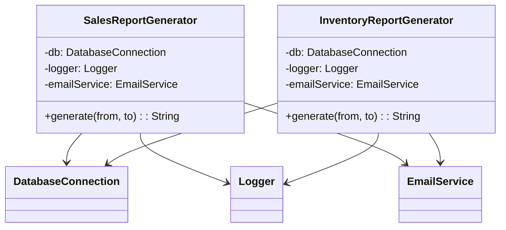

# Задание 2: Template Method - генераторы отчетов

## Проблема

Есть два класса - SalesReportGenerator и InventoryReportGenerator. Они делают почти одно и то же, только с разными данными. Процентов 70 кода просто копипаста.

Что дублируется:
- Конструктор одинаковый - db, logger, emailService
- Метод generate() - одна и та же последовательность: создаем StringBuilder, добавляем заголовок, грузим данные из БД, проверяем что не пусто, циклом форматируем строки, логируем, отправляем email, возвращаем результат
- Даже проверка на пустоту написана одинаково

Основные косяки:
- Если надо добавить новый этап (например архивирование) - надо лезть в оба класса и добавлять одно и то же
- Формат захардкожен - только текст. Хочешь CSV или HTML - переписывай все
- Logger и EmailService намертво вшиты в generate() - нельзя гибко настроить постобработку

WMC (сложность методов) посчитал - у SalesReportGenerator выходит 3, у InventoryReportGenerator - 2. В сумме 5 на всю систему.

## Что сделал

Применил три паттерна:

**1. Template Method**
Сделал абстрактный класс AbstractReportGenerator<T> - он содержит общий алгоритм в методе generate() (он final, нельзя переопределить). А конкретные классы (SalesReportGenerator, InventoryReportGenerator) переопределяют только свои специфичные части - заголовок, загрузку данных, форматирование строк.

Добавил еще FinancialReportGenerator чтобы показать как легко добавлять новые типы.

**2. Strategy для форматов**
Сделал интерфейс ReportFormatter с тремя реализациями - TextFormatter, CsvFormatter, HtmlFormatter. Теперь можно в рантайме менять формат без изменения генераторов.

**3. Chain of Responsibility для постобработки**
Цепочка обработчиков - LogHandler, EmailHandler, ArchiveHandler. Можно комбинировать как хочешь - например сначала лог, потом email, потом архив. Или только лог. Гибко.

## UML-диаграммы

### Диаграмма классов ДО рефакторинга



### Диаграмма классов ПОСЛЕ рефакторинга


## Метрики

| Класс | ДО | ПОСЛЕ |
|-------|-----|-------|
| SalesReportGenerator | 3 | 5 |
| InventoryReportGenerator | 2 | 5 |
| Общая WMC | 5 (2 класса) | 24 (10 классов) |

Да, общая сложность выросла, но теперь каждый класс делает одну вещь. И можно легко добавлять новые отчеты/форматы/обработчики не трогая существующий код.

## Как запустить

```bash
cd task2-template-method/after
javac *.java
java Main
```

Примечание: Код написан валидно, но для запуска требуется установленная JDK.
