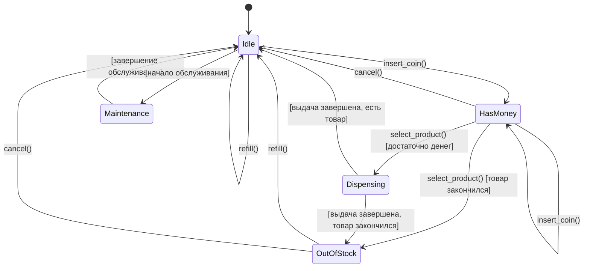

# Задание 3: State Pattern - торговый автомат

## Проблема

Торговый автомат написан на процедурках с кучей if-elif во всех функциях. В каждой функции (insert_coin, select_product, cancel, refill) сидит проверка состояния через 4 ветки if-elif.

Например:
```python
if machine['state'] == STATE_DISPENSING:
    print('Please wait, dispensing...')
```
Это повторяется во всех функциях.

Косяки:
- Циклическая сложность 4-5 на каждую функцию из-за if-elif
- Чтобы добавить новое состояние (например MAINTENANCE) - надо лезть во все 4 функции и добавлять новые ветки
- Все завязано на словарь machine и константы состояний
- OCP нарушен - для расширения надо менять код

## Что сделал

Применил паттерн State. Создал абстрактный класс VendingState с методами insert_coin(), select_product(), cancel(), refill().

Каждое состояние - отдельный класс:
- IdleState - ожидание
- HasMoneyState - деньги внесены
- DispensingState - выдача товара
- OutOfStockState - нет товара
- MaintenanceState - техобслуживание (добавил чтобы показать как легко расширять)

VendingMachine просто делегирует вызовы текущему состоянию. Теперь логика каждого состояния изолирована в своем классе, if-elif нет, циклическая сложность 1-2 вместо 4-5.

## Диаграмма состояний



## Метрики

| Метрика | ДО | ПОСЛЕ |
|---------|-----|-------|
| Цикломатическая сложность | 4-5 на функцию | 1-2 на метод |
| Количество классов | 0 | 7 |
| Чтобы добавить состояние | Менять 4 функции | Создать 1 класс |

## Как запустить тесты

```bash
cd task3-state-pattern
pytest tests/
```
