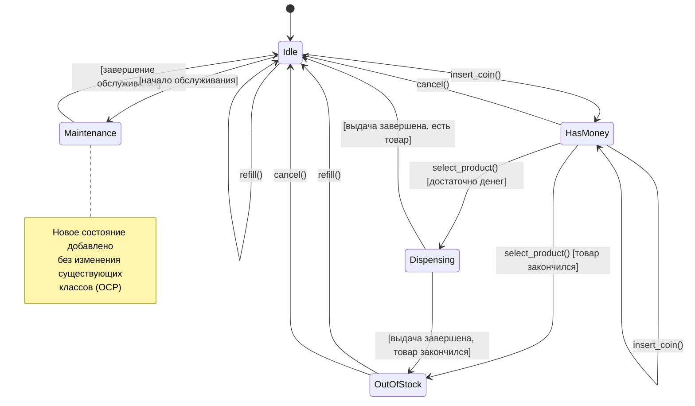

# Задание 3: State Pattern - торговый автомат

## Анализ проблем

### Code Smells

#### 1. Switch Statements / Long if-elif chains
Каждая функция содержит проверку состояния через if-elif:
- `insert_coin()`: 4 ветки (строки 7, 11, 14, 16)
- `select_product()`: 4 ветки (строки 20, 22, 41, 43)
- `cancel()`: 4 ветки (строки 47, 49, 54, 56)
- `refill()`: 4 ветки (строки 62, 65, 69, 71)

#### 2. Дублирование логики
Одинаковые проверки состояния повторяются в разных функциях:
```python
if machine['state'] == STATE_DISPENSING:
    print('Please wait, dispensing...')
```

#### 3. Tight Coupling
Все функции завязаны на структуру словаря `machine` и константы состояний.

#### 4. Сложность добавления новых состояний
Для добавления нового состояния (например, `MAINTENANCE`) нужно:
- Добавить новую константу
- Модифицировать все 4 функции
- Добавить новые ветки if-elif

### Проблемы проектирования

#### 1. Нарушение OCP (Open/Closed Principle)
Код не открыт для расширения. Каждое новое состояние требует изменения существующих функций.

#### 2. Высокая цикломатическая сложность
Каждая функция имеет сложность 4-5 из-за множественных if-elif.

#### 3. Сложность тестирования
Необходимо тестировать все возможные комбинации состояний и действий.

## Решение

### Применение паттерна State

Создан ABC-класс `VendingState` с абстрактными методами:
- `insert_coin()`
- `select_product()`
- `cancel()`
- `refill()`

Каждое состояние - отдельный класс:
1. **IdleState** - ожидание
2. **HasMoneyState** - деньги внесены
3. **DispensingState** - выдача товара
4. **OutOfStockState** - нет товара
5. **MaintenanceState** - техобслуживание (добавлено без изменения существующих классов)

Класс `VendingMachine` (контекст) делегирует вызовы текущему состоянию.

### Как решены проблемы

- **OCP**: Новое состояние `MaintenanceState` добавлено без изменения существующих классов
- **Нет if-elif**: Логика переходов инкапсулирована в классах состояний
- **Простота тестирования**: Каждое состояние тестируется независимо
- **Низкая цикломатическая сложность**: Каждый метод состояния имеет линейную логику

## Диаграмма состояний



## Метрики

### Цикломатическая сложность

**ДО:**
- `insert_coin()`: 4 (4 ветки if-elif)
- `select_product()`: 5 (4 ветки + вложенные условия)
- `cancel()`: 4
- `refill()`: 4

**ПОСЛЕ:**
- Каждый метод в классах состояний: 1-2 (линейная логика или простые условия)
- `VendingMachine` методы: 1 (простая делегация)

### Количество классов

- ДО: 0 (процедурный код)
- ПОСЛЕ: 7 (1 абстрактный + 5 состояний + 1 контекст)

### Расширяемость

- ДО: Для добавления нового состояния нужно изменить 4 функции
- ПОСЛЕ: Новое состояние = новый класс без изменения существующих (OCP)

## Как запустить тесты

```bash
cd task3-state-pattern
pytest tests/
```
