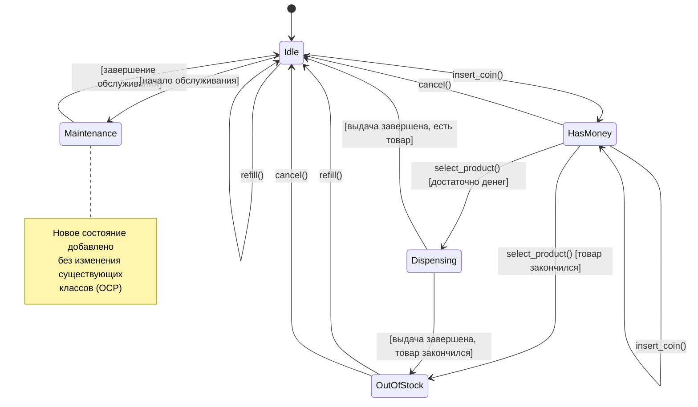

# Диаграмма состояний торгового автомата

```mermaid
stateDiagram-v2
    [*] --> Idle

    Idle --> HasMoney: insert_coin()
    Idle --> Idle: refill()

    HasMoney --> Dispensing: select_product() [достаточно денег]
    HasMoney --> OutOfStock: select_product() [товар закончился]
    HasMoney --> HasMoney: insert_coin()
    HasMoney --> Idle: cancel()

    Dispensing --> Idle: [выдача завершена, есть товар]
    Dispensing --> OutOfStock: [выдача завершена, товар закончился]

    OutOfStock --> Idle: refill()
    OutOfStock --> Idle: cancel()

    Maintenance --> Idle: [завершение обслуживания]
    Idle --> Maintenance: [начало обслуживания]

    note right of Maintenance
        Новое состояние добавлено
        без изменения существующих
        классов (OCP)
    end note
```
