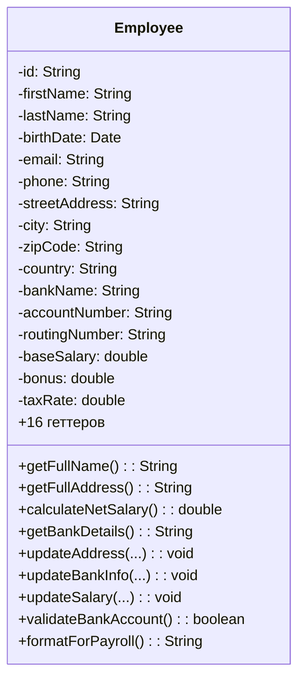
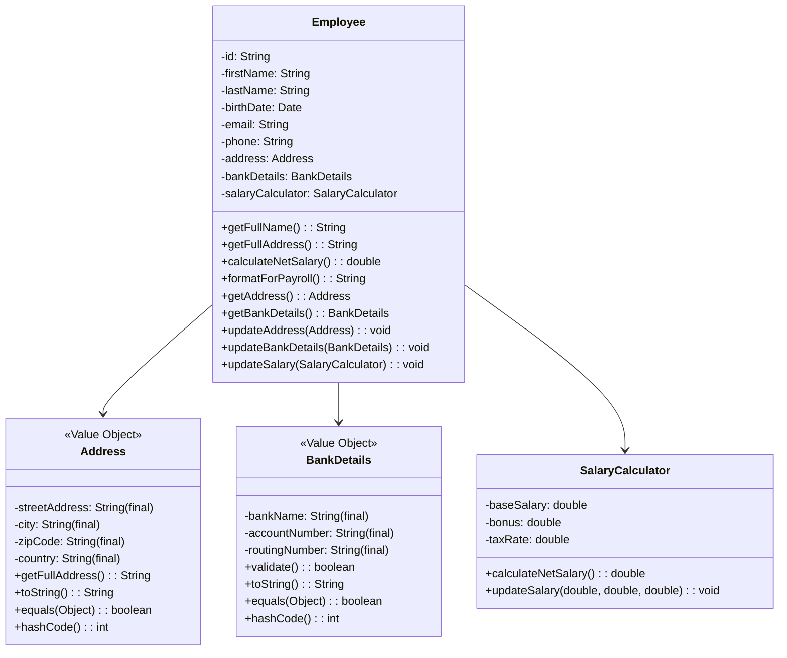

# Задание 4: Extract Class - Employee

## Проблема

Класс Employee раздут - 16 полей делают кучу разного. Есть несколько групп полей которые всегда используются вместе (Data Clumps):

1. **Адрес** - streetAddress, city, zipCode, country. Всегда используются в getFullAddress() и updateAddress()
2. **Банк** - bankName, accountNumber, routingNumber. Используются в getBankDetails(), validateBankAccount()
3. **Зарплата** - baseSalary, overtimeHours, taxRate, pensionRate, healthInsuranceRate. Все для calculateNetSalary()

Проблемы:

- Конструктор на 16 параметров - легко напутать порядок
- Feature Envy - метод calculateNetSalary() работает только с полями зарплаты, getFullAddress() только с адресом и т.д.
- Нарушен закон Деметры - клиент вызывает employee.getCity() напрямую достает внутренности

LCOM посчитал - получилось 4 (количество несвязанных групп методов). Это плохо, значит класс делает слишком много разного.

## Что сделал

Применил Extract Class - выделил 3 класса:

1. **Address** (Value Object) - streetAddress, city, zipCode, country. Immutable (все final), есть getFullAddress(), equals(), hashCode()

2. **BankDetails** (Value Object) - bankName, accountNumber, routingNumber. Тоже immutable, есть validate()

3. **SalaryCalculator** - baseSalary, overtimeHours, taxRate, pensionRate, healthInsuranceRate. Метод calculateNetSalary() с формулой:
   - gross = base + (overtime _ base / 160 _ 1.5)
   - вычитаем налоги, пенсию, страховку

Employee теперь просто хранит личные данные + агрегирует эти 3 класса. Методы перенес куда надо - getFullAddress() в Address, validateBankAccount() в BankDetails и т.д.

## UML-диаграммы

### Диаграмма классов ДО рефакторинга



### Диаграмма классов ПОСЛЕ рефакторинга



## Метрики

### Сравнение метрик ДО и ПОСЛЕ

| Метрика                     | ДО            | ПОСЛЕ                     |
| --------------------------- | ------------- | ------------------------- |
| LCOM                        | 4             | 1 (на каждый класс)       |
| Количество полей в Employee | 16            | 9 (6 личных + 3 агрегата) |
| Количество классов          | 1             | 4                         |
| Связность (cohesion)        | Низкая        | Высокая                   |
| Длина конструктора          | 16 параметров | 9 параметров              |
| Тестируемость               | Низкая        | Высокая                   |

Теперь каждый класс делает одну вещь, LCOM везде = 1. Можно переиспользовать Address и BankDetails в других местах типа Customer или Supplier.

## Как запустить тесты

```bash
cd task4-extract-class/tests
javac -cp .:junit-4.13.2.jar:hamcrest-core-1.3.jar *.java
java -cp .:junit-4.13.2.jar:hamcrest-core-1.3.jar org.junit.runner.JUnitCore EmployeeTest
```
