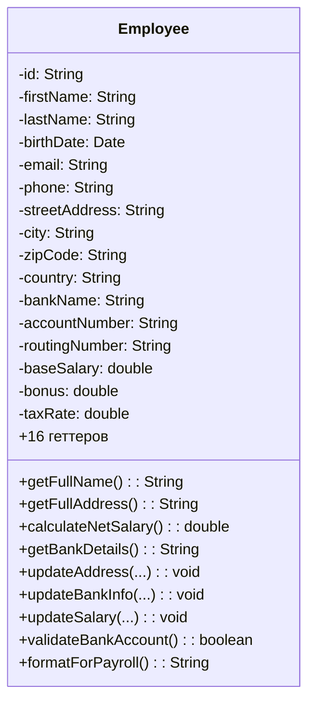
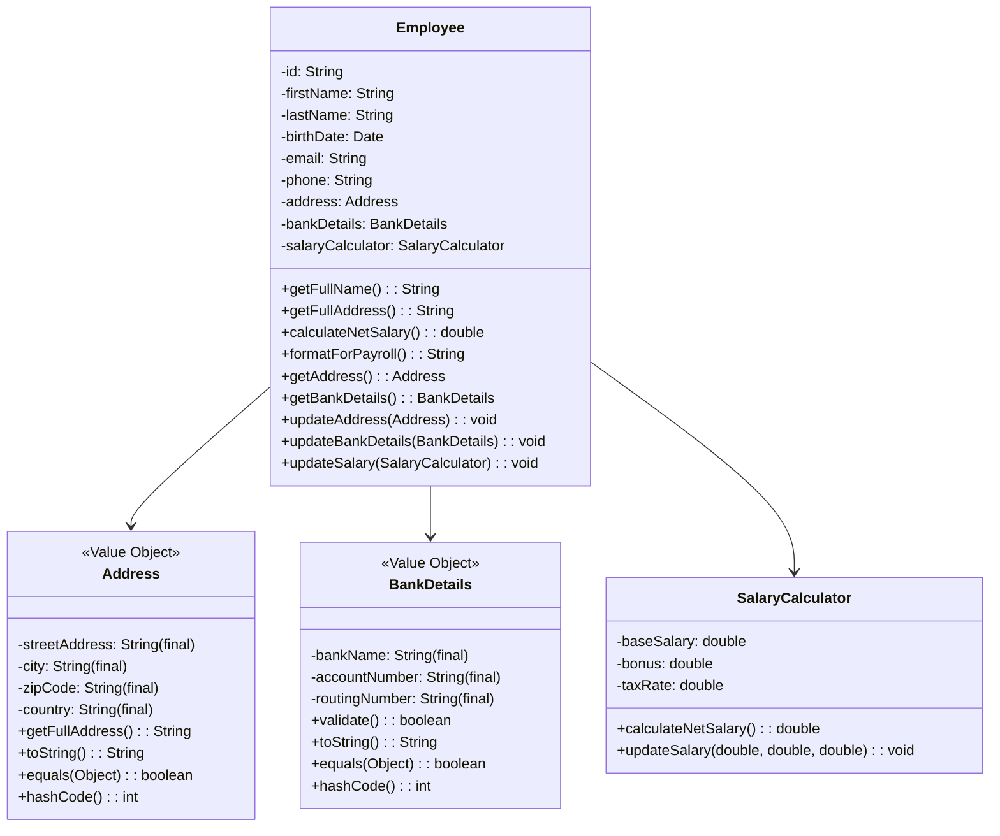

# Задание 4: Extract Class - Employee

## Анализ проблем

### Code Smells

#### 1. Data Clumps (Группы связанных данных)

Класс `Employee` содержит несколько групп связанных полей, которые всегда используются вместе:

**Группа 1: Адрес (строки 11-14)**
```java
private String streetAddress;
private String city;
private String zipCode;
private String country;
```
Эти поля связаны логически и всегда используются вместе в методах `getFullAddress()` и `updateAddress()`.

**Группа 2: Банковские данные (строки 16-18)**
```java
private String bankName;
private String accountNumber;
private String routingNumber;
```
Связаны логически, используются вместе в `getBankDetails()`, `updateBankInfo()`, `validateBankAccount()`.

**Группа 3: Данные зарплаты (строки 20-22 + строки 7-8)**
```java
private double baseSalary;
private int overtimeHours;
private double taxRate;
private double pensionRate;
private double healthInsuranceRate;
```
Используются вместе в `calculateNetSalary()` и `updateSalary()`. Формула расчета включает сверхурочные часы и дополнительные отчисления.

#### 2. Large Class
Класс содержит 16 полей и отвечает за слишком много аспектов:
- Личные данные сотрудника
- Адресная информация
- Банковская информация
- Расчет зарплаты
- Форматирование для payroll

#### 3. Long Parameter List
Конструктор принимает 16 параметров (строки 24-28), что делает его сложным в использовании и подверженным ошибкам.

#### 4. Feature Envy
- Метод `calculateNetSalary()` (строка 55) работает только с полями зарплаты
- Метод `validateBankAccount()` (строка 84) работает только с банковскими полями
- Метод `getFullAddress()` (строка 51) работает только с адресными полями

Эти методы "завидуют" данным других классов и должны быть перемещены.

#### 5. Нарушение закона Деметры (Law of Demeter)
Клиентский код должен делать цепочки вызовов:
```java
employee.getCity()  // напрямую достает внутренние детали адреса
employee.getBankName()  // напрямую достает внутренние детали банка
```

### Нарушения принципов SOLID

#### 1. SRP (Single Responsibility Principle) - НАРУШЕН
Класс имеет минимум 4 различных ответственности:
- Хранение личных данных
- Управление адресом
- Управление банковскими данными
- Расчет зарплаты

#### 2. OCP (Open/Closed Principle) - НАРУШЕН
Для добавления новых типов зарплаты (например, почасовая оплата, комиссионные) нужно изменять класс Employee.

### Метрики

#### LCOM (Lack of Cohesion of Methods) - ДО

LCOM измеряет связность методов класса. Высокое значение указывает на низкую связность.

**Подсчет:**
- Методы, использующие адресные поля (4): `getFullAddress`, `updateAddress`, `getStreetAddress`, `getCity`, `getZipCode`, `getCountry`
- Методы, использующие банковские поля (3): `getBankDetails`, `updateBankInfo`, `validateBankAccount`, `formatForPayroll`, `getBankName`, `getAccountNumber`, `getRoutingNumber`
- Методы, использующие зарплатные поля (3): `calculateNetSalary`, `updateSalary`, `formatForPayroll`, `getBaseSalary`, `getBonus`, `getTaxRate`
- Методы, использующие личные поля (2): `getFullName`, `formatForPayroll`, геттеры

**LCOM = 4** (количество несвязанных групп методов)

Высокое значение LCOM указывает на то, что класс делает слишком много несвязанных вещей.

## Решение

### Выделенные классы

#### 1. Address (Value Object)
Инкапсулирует адресную информацию:
- Поля: `streetAddress`, `city`, `zipCode`, `country`
- Методы: `getFullAddress()`, `toString()`
- **Immutable** - все поля final, без сеттеров
- Переопределены `equals()`, `hashCode()`

#### 2. BankDetails (Value Object)
Инкапсулирует банковскую информацию:
- Поля: `bankName`, `accountNumber`, `routingNumber`
- Методы: `validate()`, `toString()`
- **Immutable** - все поля final, без сеттеров
- Переопределены `equals()`, `hashCode()`

#### 3. SalaryCalculator
Отвечает за расчет зарплаты:
- Поля: `baseSalary`, `bonus`, `taxRate`
- Метод: `calculateNetSalary()`
- Позволяет легко расширять логику расчета (например, добавить пенсионные отчисления)

#### 4. Employee (рефакторированный)
Теперь использует выделенные классы:
- Личные данные (id, firstName, lastName, birthDate, email, phone)
- Агрегирует: `Address`, `BankDetails`, `SalaryCalculator`
- Методы-делегаты для удобства, но не нарушающие закон Деметры

### Move Method

Методы перемещены в соответствующие классы:
- `getFullAddress()` → `Address.getFullAddress()`
- `validateBankAccount()` → `BankDetails.validate()`
- `getBankDetails()` → `BankDetails.toString()`
- `calculateNetSalary()` → `SalaryCalculator.calculateNetSalary()`

### Соблюдение закона Деметры

**ДО (нарушение):**
```java
String city = employee.getCity();  // прямой доступ к внутренностям
```

**ПОСЛЕ (соблюдение):**
```java
String fullAddress = employee.getFullAddress();  // делегация
// или передача объекта напрямую:
Address address = employee.getAddress();
```

## UML-диаграммы

### Диаграмма классов ДО рефакторинга



### Диаграмма классов ПОСЛЕ рефакторинга



## Метрики

### Сравнение метрик ДО и ПОСЛЕ

| Метрика | ДО | ПОСЛЕ |
|---------|-----|-------|
| LCOM | 4 | 1 (на каждый класс) |
| Количество полей в Employee | 16 | 9 (6 личных + 3 агрегата) |
| Количество классов | 1 | 4 |
| Связность (cohesion) | Низкая | Высокая |
| Длина конструктора | 16 параметров | 9 параметров |
| Тестируемость | Низкая | Высокая |

### LCOM ПОСЛЕ

**Employee:**
- Все методы теперь работают с личными данными или делегируют вызовы
- **LCOM = 1** (высокая связность)

**Address:**
- Все методы работают с адресными полями
- **LCOM = 1**

**BankDetails:**
- Все методы работают с банковскими полями
- **LCOM = 1**

**SalaryCalculator:**
- Все методы работают с зарплатными полями
- **LCOM = 1**

## Преимущества рефакторинга

1. **Повторное использование**: Value Objects можно использовать в других классах (Customer, Supplier)
2. **Тестируемость**: Каждый класс можно тестировать независимо
3. **Расширяемость**: Легко добавить новые типы адресов или методы расчета зарплаты
4. **Понятность**: Каждый класс имеет четкую ответственность
5. **Иммутабельность**: Value Objects потокобезопасны

## Как запустить тесты

```bash
cd task4-extract-class/tests
javac -cp .:junit-4.13.2.jar:hamcrest-core-1.3.jar *.java
java -cp .:junit-4.13.2.jar:hamcrest-core-1.3.jar org.junit.runner.JUnitCore EmployeeTest
```
