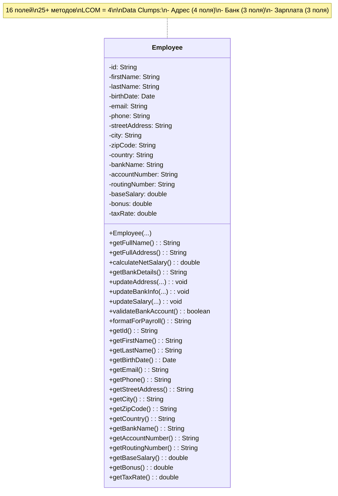

# UML-диаграмма классов ДО рефакторинга

```mermaid
classDiagram
    class Employee {
        -id: String
        -firstName: String
        -lastName: String
        -birthDate: Date
        -email: String
        -phone: String
        -streetAddress: String
        -city: String
        -zipCode: String
        -country: String
        -bankName: String
        -accountNumber: String
        -routingNumber: String
        -baseSalary: double
        -bonus: double
        -taxRate: double
        +Employee(...)
        +getFullName(): String
        +getFullAddress(): String
        +calculateNetSalary(): double
        +getBankDetails(): String
        +updateAddress(...): void
        +updateBankInfo(...): void
        +updateSalary(...): void
        +validateBankAccount(): boolean
        +formatForPayroll(): String
        +getId(): String
        +getFirstName(): String
        +getLastName(): String
        +getBirthDate(): Date
        +getEmail(): String
        +getPhone(): String
        +getStreetAddress(): String
        +getCity(): String
        +getZipCode(): String
        +getCountry(): String
        +getBankName(): String
        +getAccountNumber(): String
        +getRoutingNumber(): String
        +getBaseSalary(): double
        +getBonus(): double
        +getTaxRate(): double
    }

    note for Employee "16 полей\n25+ методов\nLCOM = 4\n\nData Clumps:\n- Адрес (4 поля)\n- Банк (3 поля)\n- Зарплата (3 поля)"
```
