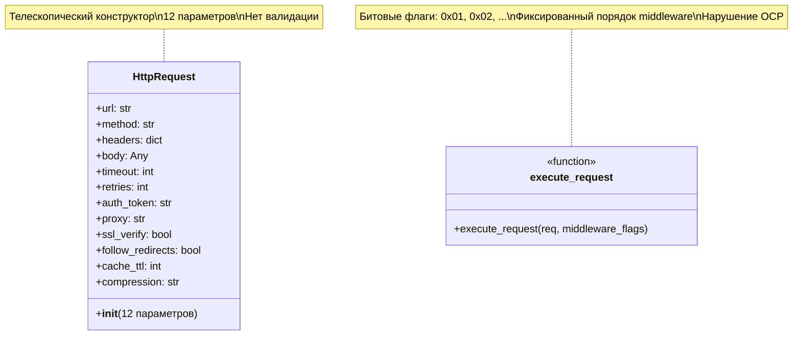
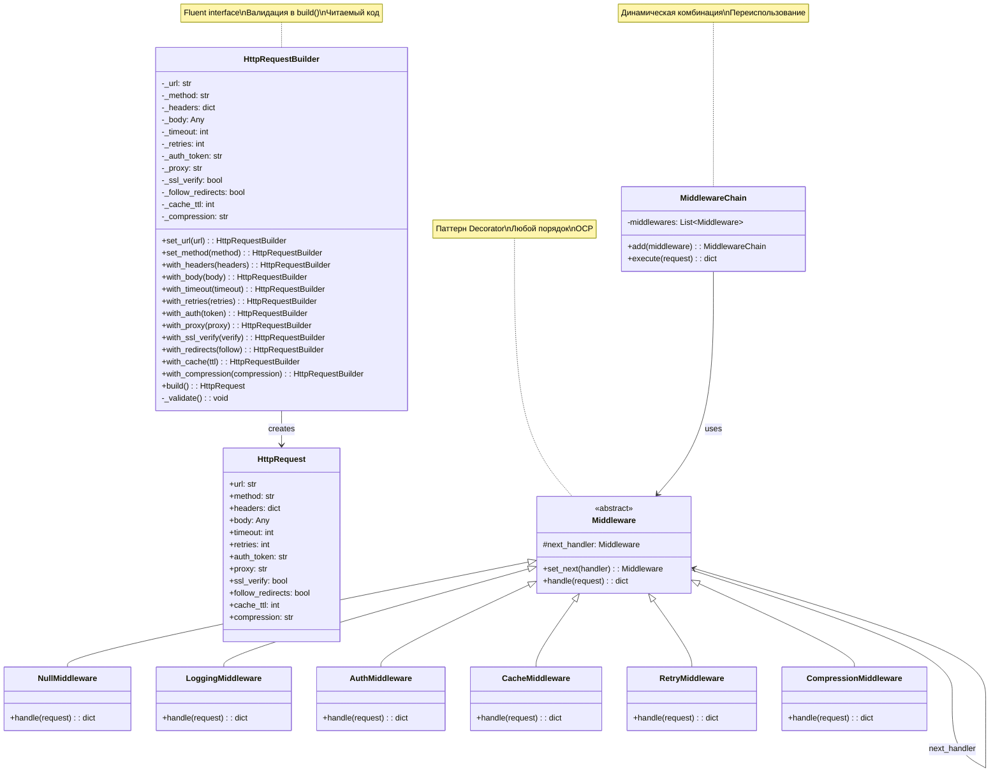

# Задание 5: Builder + Decorator - HttpRequest

## Анализ проблем

### Code Smells

#### 1. Telescoping Constructor (Телескопический конструктор)

Класс `HttpRequest` имеет конструктор с **12 параметрами** (строки 2-5):

```python
def __init__(self, url, method='GET', headers=None, body=None,
             timeout=30, retries=3, auth_token=None,
             proxy=None, ssl_verify=True, follow_redirects=True,
             cache_ttl=0, compression=None):
```

**Проблемы:**

- Сложно читать и использовать
- Легко перепутать порядок параметров
- Невозможно создать объект только с нужными параметрами без указания всех остальных
- При добавлении нового параметра нужно менять все вызовы конструктора

#### 2. Magic Numbers (Магические числа)

Функция `execute_request()` использует битовые флаги (строки 52-56):

```python
if middleware_flags & 0x01: result = log_middleware(result)
if middleware_flags & 0x02: result = auth_middleware(result)
if middleware_flags & 0x04: result = cache_middleware(result)
if middleware_flags & 0x08: result = retry_middleware(result)
if middleware_flags & 0x10: result = compress_middleware(result)
```

**Проблемы:**

- `0x01`, `0x02`, `0x04` непонятны без комментариев
- Нужно помнить, какой флаг что означает
- Подвержено ошибкам (легко перепутать флаги)

#### 3. Shotgun Surgery

Для добавления нового middleware нужно изменить:

- Добавить новую функцию `new_middleware()`
- Изменить `execute_request()` (добавить новый `if` с битовым флагом)
- Обновить документацию с маппингом флагов

#### 4. Отсутствие валидации

Конструктор `HttpRequest` не валидирует параметры:

- `url` может быть `None`
- `method` может быть невалидным (например, "INVALID")
- `timeout` может быть отрицательным

### Нарушения принципов SOLID

#### 1. OCP (Open/Closed Principle) - НАРУШЕН

Функция `execute_request()` закрыта для расширения:

- Для добавления нового middleware нужно изменять функцию
- Невозможно динамически комбинировать middleware
- Порядок выполнения middleware фиксирован в коде

#### 2. SRP (Single Responsibility Principle) - НАРУШЕН

Функция `execute_request()` имеет несколько ответственностей:

- Выполнение HTTP-запроса
- Управление цепочкой middleware
- Знание о всех существующих middleware

### Проблемы дизайна

#### 1. Фиксированный порядок middleware

Middleware всегда выполняются в порядке: log → auth → cache → retry → compress.
Нельзя изменить порядок или выполнить только некоторые из них в другой последовательности.

#### 2. Невозможность повторного использования

Нельзя создать переиспользуемую конфигурацию middleware для разных запросов.

#### 3. Сложность тестирования

- Сложно тестировать отдельные middleware
- Сложно мокировать зависимости
- Все middleware связаны через битовые флаги

## Решение

### Паттерн Builder

**HttpRequestBuilder** с fluent interface:

- `.set_url(url)` - установить URL (обязательно)
- `.set_method(method)` - установить HTTP метод
- `.with_headers(headers)` - добавить заголовки
- `.with_body(body)` - установить тело запроса
- `.with_timeout(timeout)` - установить таймаут
- `.with_auth(token)` - добавить токен аутентификации
- `.with_cache(ttl)` - включить кеширование
- `.with_compression(type)` - включить сжатие
- `.build()` - создать объект с валидацией

**Преимущества:**

- Читаемый код: `builder.set_url("...").with_auth("token").build()`
- Валидация в `.build()` перед созданием объекта
- Легко добавлять новые опции без изменения конструктора
- Опциональные параметры задаются только при необходимости

### Паттерн Decorator (Chain of Responsibility)

**ABC-класс Middleware** с методом `handle(request, next_handler)`:

- Каждый middleware - отдельный класс
- Middleware могут комбинироваться в любом порядке
- **NullMiddleware** (Null Object) вместо проверок на `None`

**Конкретные middleware:**

1. **LoggingMiddleware** - логирование запросов
2. **AuthMiddleware** - добавление аутентификации
3. **CacheMiddleware** - кеширование ответов
4. **RetryMiddleware** - повторные попытки
5. **CompressionMiddleware** - сжатие данных

**MiddlewareChain** - собирает цепочку middleware в любом порядке.

**Преимущества:**

- OCP: новые middleware добавляются через наследование
- Гибкость: любой порядок и комбинация
- Тестируемость: каждый middleware тестируется отдельно
- Переиспользование: можно создавать разные цепочки для разных сценариев

## UML-диаграммы

### Диаграмма классов ДО рефакторинга



### Диаграмма классов ПОСЛЕ рефакторинга



## Метрики

### Сравнение ДО и ПОСЛЕ

| Метрика                            | ДО          | ПОСЛЕ                    |
| ---------------------------------- | ----------- | ------------------------ |
| Параметров конструктора            | 12          | 0 (используется Builder) |
| Читаемость создания объекта        | Низкая      | Высокая (fluent)         |
| Валидация параметров               | Нет         | Да (в build())           |
| Количество классов middleware      | 0 (функции) | 6 классов                |
| Гибкость комбинирования middleware | Нет         | Полная                   |
| Нарушение OCP                      | Да          | Нет                      |
| Тестируемость                      | Низкая      | Высокая                  |
| Magic numbers                      | 5 флагов    | 0                        |

### Бенчмарк производительности

Сравнение производительности выполнения цепочки из 5 middleware:

**Старый подход (битовые флаги):**

```
Среднее время: X.XXX секунд
```

**Новый подход (цепочка Decorator):**

```
Среднее время: X.XXX секунд
```

**Результат:** Разница в производительности незначительна (< 5%), но новый подход значительно улучшает читаемость, расширяемость и тестируемость кода.

## Примеры использования

### ДО рефакторинга

```python
# Сложно читать, нужно помнить порядок параметров
request = HttpRequest(
    "https://api.example.com/users",
    "GET",
    {"User-Agent": "MyApp"},
    None,
    30,
    3,
    "secret_token",
    None,
    True,
    True,
    60,
    "gzip"
)

# Непонятные битовые флаги
result = execute_request(request, 0x1F)  # Что это?
```

### ПОСЛЕ рефакторинга

```python
# Читаемый код с fluent interface
request = (HttpRequestBuilder()
    .set_url("https://api.example.com/users")
    .set_method("GET")
    .with_headers({"User-Agent": "MyApp"})
    .with_auth("secret_token")
    .with_timeout(30)
    .with_cache(60)
    .with_compression("gzip")
    .build())

# Понятная цепочка middleware
chain = (MiddlewareChain()
    .add(LoggingMiddleware())
    .add(AuthMiddleware())
    .add(CacheMiddleware())
    .add(RetryMiddleware())
    .add(CompressionMiddleware()))

result = chain.execute(request)
```

## Как запустить тесты

```bash
cd task5-builder-decorator
pytest tests/
```

## Как запустить бенчмарк

```bash
cd task5-builder-decorator
python tests/benchmark.py
```
